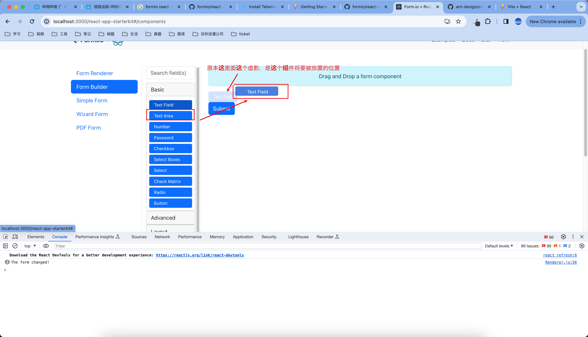
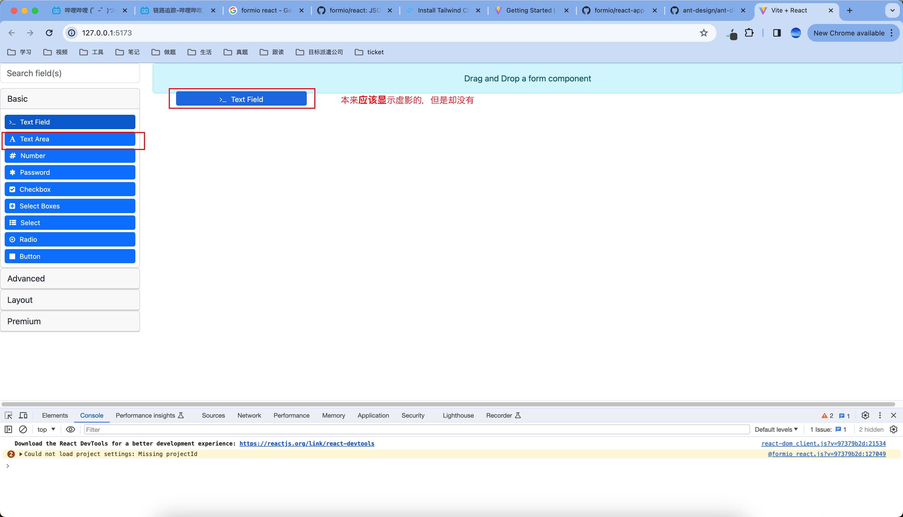
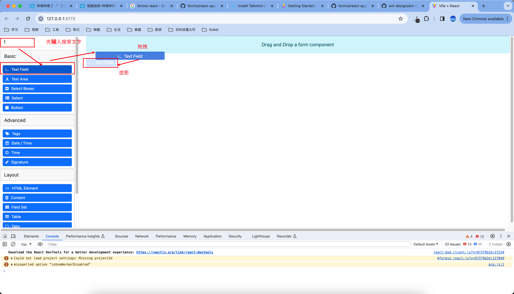

# Bug再现steps
## 现象
### 原本应该有的动作
使用formiojs， 地址： https://github.com/formio/react  
做一个拖拽组件的页面。首次进入页面，会出现一个拖拽组件的页面。原本正常的现象是，当拖拽一个组件到屏幕中央，会显示一个组件将要被放置的位置，如下图：
这个例子的项目地址是：https://github.com/formio/react-app-starterkit

### 我这边的动作
我用react + vite来构建这个项目，我自己本地的项目跑起来的时候，当拖拽组件的时候，不会显示组件将要被放置位置的虚影，如下图：

但是如果是我在组件搜索框输入一些东西，然后在拖拽组件的话，虚影又会显示出来：如下图

# 这个项目启动方法
1. npm install
2. npm run dev